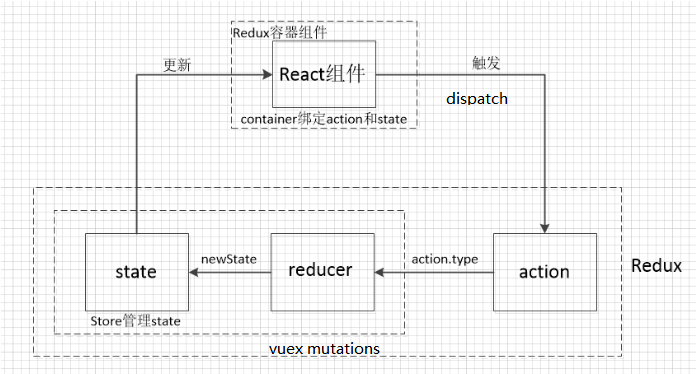
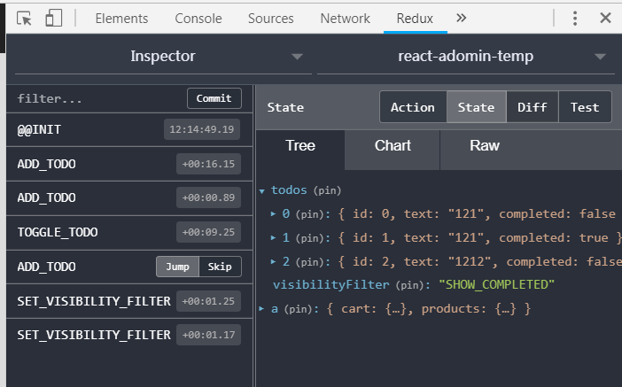

### 提纲
* react
* redux
* react-redux
* redux-thunk
* redux文件组织
* redux开发工具
* vuex与redux比较
* react学习路线

### react
参考demo todos-no-redux
##### react主要构成
* jsx：html写在js里return出来，css外部引入或者css-in-js
* props：由父组件传过来的 单项数据流 只读不可写(写就是子组件改变父组件了)
* state：组件内部状态 可读可写 写必须通过setState方法
* 生命周期：
  * componentDidMount 初始数据请求放这里
  * componentWillReceiveProps props变化触发 暴露nextProps
  * shouldComponentUpdate 组件是否重新render 优化关键点
* render：什么时候会重新render
  * 首次加载
  * setState改变组件内部state。 
  * 接受到新的props
##### 无状态组件 有状态组件
``` javascript
// 无状态组件
const TodoList = ({ todos, toggleTodo }) => {
  return (
    <div>aaa</div>
  ) 
}
```
``` javascript
// 有状态组件 有state，需要访问生命周期方法
class InputControlES6 extends React.Component {
  constructor(props) {
    super(props);
    // 设置 initial state
    this.state = {
        text: props.initialValue || 'placeholder'
    };
    // 手动绑定this
    this.handleChange = this.handleChange.bind(this);
  }
  handleChange(event) {
    this.setState({
        text: event.target.value
    });
  }
  render() {
    return (
      <input onChange={this.handleChange} value={this.state.text} />
    );
  }
}
```
* 无状态组件是一个函数，不会有实例化的过程，无实例化就不需要分配多余的内存，从而性能得到一定的提升。
* 无状态组件由于没有实例化过程，所以无法访问组件this中的对象，例如：
  * this.props 这个是函数组件参数里已经传了
  * this.func 直接func调用
  * this.refs `<input ref={node => input = node}>`访问dom
  * this.state 这个无法解决
* 无状态组件无法访问生命周期的方法。
* 无状态组件只能访问输入的props，同样的props会得到同样的渲染结果。
* 只要有可能，尽量使用无状态组件。否则（**如需要state、生命周期方法等**），使用`React.Component`这种es6形式创建组件
##### 从上到下的数据流
* props 父往子组件传
* states 组件内部状态
* 子组件想往父组件传数据，父组件定义函数传到子组件执行后回调到父组件函数的参数里
* 抽组件的时候，让子组件尽量为无状态组件（形成 props => 组件 的抽象，便于复用）

### redux
为了解决组件间的状态传递 启用redux 参考demo counter
##### dataflow

##### apis
* reducer: store = createStore(reducers)
* state: store.getState()
* action: store.dispatch(action)
* subscribe: store.subscribe(listener)
* combineReducers: 组织state数据结构
* applyMiddleware: 中间件

### react-redux
为了解决store state dispatch一直往下传递 启用react-redux 参考demo todos-react-redux
##### apis
* Provider 为每层组件注入store
* connect(mapStateToProps, mapDispatchToPros)(comp) 在任意组件用connect为props添加state及dispatch
``` javascript
// 暴露state 此组件有了 this.props.todos 由state计算而来
const mapStateToProps = (state) => {
  return {
    todos: getFilterTodos(state.todos, state.visibleFilter)
  }
}
// 暴露dispatch 此组件有了this.props.toggleTodoClick 执行这个函数有相应的dispatch
const mapDispatchToProps = (dispatch) => {
  return {
    toggleTodoClick: (id) => {
      dispatch(toggleTodo(id))
    }
  }
}
```
##### tips
* 用combineReducers形成各种state数据结构 参考demo react-adomin-temp src store
* applyMiddleware中间件
* reducer必须是纯函数(相同的输入相同的输出) 也就是不能改变state的引用, 否则不触发重新渲染。 [参考文档 Immutable](http://www.redux.org.cn/docs/recipes/reducers/ImmutableUpdatePatterns.html)
* 复杂数据项目 用**reselect**缓存数据
``` javascript
// state.values.value1 state.values.value2变化才会重新执行totalSelector
const totalSelector = createSelector(
  [
    state => state.values.value1,
    state => state.values.value2
  ],
  (value1, value2) => value1 + value2
)
```
* 复杂项目用**normalizr**做数据扁平化
数据扁平化主要是为了
  * 冗余数据少，找某个值不用像a.b.c.d.e这种找太深，提高性能
  * 因为reducer强调immutable，在没有用immutable相关库的情况下如果不扁平化数据，修改a.b.c.d.e这种数据非常麻烦
  * [参考：State 范式化](http://www.redux.org.cn/docs/recipes/reducers/NormalizingStateShape.html)

### redux-thunk
参考demo async-with-thunk
actionCreator return object，无法在里面做异步操作，所以引入redux-thunk。actionCreator可以 return function，并且暴露dispatch用于发action，暴露getState用于拿到所有state。
vuex中不存在以上问题(action直接写函数然后在里面emmit mutations,rootState可以拿到所有state) 所以不需要thunk这种东西
``` javascript
// 普通的actionCreator
const fetchPosts = postId => {
  return {
    type: 'FETCHPOSTS'
    postId
  }
}
// redux-thunk actionCreator return function
const fetchPosts = postId => {
  return (dispatch, getState) => {
    return fetch(`/some/API/${postId}.json`)
      .then(json => dispatch(receivePosts(postId, json)));
  };
}
```

### redux-saga
* call(fn, ...args) 阻塞，fork(fn, ...args) 非阻塞
* take(acitonType), takeEvery(acitonType, fn), takeLastes(acitonType, fn)
* put(action)
* all[fork(fn1), fork(fn2)]
* select(state => state.xxxx)

### redux文件组织
[参考链接](https://blog.csdn.net/sinat_17775997/article/details/57917169)
* redux官方文件组织
* ducks模式
* types是连接dispatch和reducer的唯一key 如何保证不重复

### redux开发工具
* redux-logger
* redux-devtools-extension + chrome Redux DevTools, 进行time-travel


### vuex与redux全家桶比较
##### 大致类比
|  | vuex | redux全家桶 |
|---|---|---|
| actions | action暴露了dispatch及rootStore，可以直接在里面异步操作<br/>所以不需要redux-thunk | actionCreator(redux-thunk) |
| mutations | 可以随便改state不强制immutable | reducers函数，强制immutable否则不刷新界面 |
| state | Vue对象注入了store，在组件里直接拿 | 通过combineReducer组织state数据结构<br>为了在组件里dispatch和拿state需要react-redux |
| modules | 带modules方便组织文件结构 | 按业务分，按类型分，ducks，要保证types唯一性 |
##### 对比
* redux强调必须按dispatch(actionCreator)->触发reducer->产生新state的flux流程，要改state必须dispatch，虽然麻烦但是规矩清晰易懂，结合开发工具一定能time-travel调试。
* vuex采用配置式 actions mutations state 某些不写也可以，但是为什么最佳实践是不嫌麻烦都写？因为
  * 只写state: 直接在组件里读写state 没有维护性
  * 只写mutations和state: mutations必须是同步逻辑(因为开发工具time-travel及快照的前提是这个，否则调试不了vuex)，所以异步逻辑只有写在组件里，降低了复用性。
  * 只写actions和state: 没有mutations就没有开发工具快照time-travel无法调试
  * actions封装异步逻辑及组合actions高内聚，mutations同步逻辑改变state用于vuex工具调试，state记录状态


### react建议学习路线
* react基础语法，css-in-js (vue有style scope)
* react-router-dom (对应vue-router)
* redux->react-redux->redux-thunk/redux-saga (对应vuex)
* mobx (替换redux全家桶)
* reslect->normalizr->immutable (vue只有normalizr)
* 进阶
  * 读Ant Design 学习react如何封装UI组件
  * 读dva框架 封装了react全家桶，学习如何组织react全家桶 
  * 读Ant Design Pro 基于dva处理中后台业务


